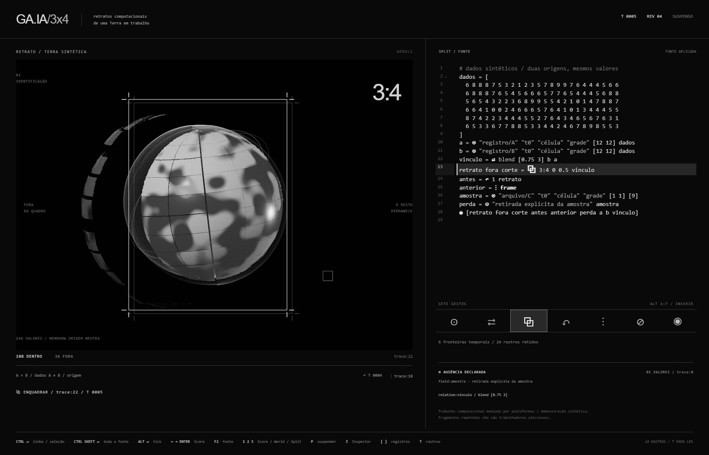

# GA.IA/3x4

**GA.IA/3x4: retratos computacionais de uma Terra em trabalho**

Instrumento de live coding com mundo persistente e recorte responsável.
O resultado principal atual é uma Terra materialmente sustentada por registros
de trabalho computacional. Seis registros **sintéticos** sustentam 144 fragmentos
3:4 com derivação rastreável. `⋮ relate` abre a cortina; `⧉` seleciona identidades
no chart projetado do runtime; `⊘` em work-demo03 retira seus 24 fragmentos e
deixa lacunas; `↶` conserva um testemunho espectral enquanto o presente roda.
Mesmo a superfície polida recebe ausências por perda de suporte.

O modo Score exibe o glifo ativo a 64px, seus operandos, nome, assinatura e
o bloco executável. **←/→ Enter**, **F2** para CodeMirror, **1/2/3** para
Score/World/Split, **I** Inspector, **[ / ]** seleção de fragmentos e **T** registro.
O aviso sintético está sempre visível com dados synthetic.

- [Partitura principal de quatro minutos e ensaio manual](docs/labour-performance.md).
- [Formato JSON, evidência e checklist de privacidade](docs/labour-data.md).
- [Fonte executável](examples/labour-score.gaia).
- [Verificação do percurso e capturas reais](artifacts/labour-verification.json).

`npm run verify:labour` verifica todos os sete glifos, edição real pelo teclado,
perda geométrica, memória persistente, Inspector, revisão recusada e performance
completa no fallback WebGL 2. **49 testes**, incluindo os 35 anteriores.
`GAIA_REHEARSAL_REALTIME=1` conserva os 240 segundos dos cinco movimentos;
o modo padrão comprime as pausas de palco.
O [ensaio em tempo real](artifacts/labour-realtime-verification.json) também
foi executado, com os cinco intervalos de 40/45/45/70/40 segundos.

As seções abaixo preservam também a documentação técnica da milestone anterior,
disponível em `/?score=legacy`; a nova partitura não a substitui nem apaga seus
testes ou a branch local de backup. Não foram introduzidos novos glifos,
dependências, mapas reais ou relações com empresas/território/infraestrutura/guerra.

Nesta milestone, CodeMirror 6 e uma Terra 3D sintética substituem a grade como
superfície principal. O runtime, a gramática, o programa canônico e os 26
testes semânticos originais foram preservados.

## Instalar e executar

Node.js ≥ 22.15 e npm. Verificado com Node 24.11.1, npm 11.7.0,
Three.js 0.186.0 e CodeMirror 6. Dependências empacotadas localmente por esbuild:
nenhuma CDN, fonte remota, textura ou serviço de dados.

```powershell
cd "C:\Users\italo\ga.ia-3x4\gaia-3x4"
npm ci
npm test
npm run demo
npm start
```

Abra **http://127.0.0.1:3034**. O servidor atende somente em localhost.
`npm start` e `npm run dev` constroem o bundle antes de servir.
Para outra porta: `$env:PORT = '3036'; npm start`.
Para reconstruir depois de editar os módulos: `npm run build`.
Edições da partitura no navegador são aplicadas diretamente ao runtime.

## Performar

[A partitura de quatro minutos](docs/microperformance.md) descreve os sete
gestos, as alterações literais e versões de três ou cinco minutos.

| Tecla | Ação |
| --- | --- |
| Ctrl+Enter / Cmd+Enter | Aplicar linha lógica ou declarações tocadas pela seleção |
| Ctrl+Shift+Enter / Cmd+Shift+Enter | Aplicar toda a fonte |
| Alt+Enter | Um tick explícito |
| Alt+1…7 | Inserir ⊙ ⇄ ⧉ ↶ ⋮ ⊘ ◉, respectivamente |
| Ctrl+Espaço | Autocomplete; Enter aceita, Esc fecha |
| Ctrl+Shift+P | Focar paleta; setas laterais navegam, Enter insere |
| Ctrl+Shift+I | Alternar Inspector durante a escrita |
| Esc | Sair da escrita / fechar leitor de rastros |
| P, fora da escrita | Suspender / continuar ticks automáticos de 1,8 segundo |
| Espaço, fora da escrita | Um tick |
| I, fora da escrita | Alternar Terra 3D / Inspector Canvas 2D |
| T, fora da escrita | Ler todo o registro de campos, relações, revisões e rastros |
| S, no leitor | Exportar JSON |

O editor oferece histórico de escrita, seleção múltipla, busca, fechamento e
pareamento de delimitadores, dobra de vetores, autocomplete, hover e diagnósticos.
Undo/redo modifica o rascunho; não desfaz um mundo já executado.

Execução parcial conserva a fonte válida não selecionada, seus comentários e
formatação. O programa e as consequências dependentes executam no próximo tick.
Um rascunho inválido em outra linha não entra nessa transação. Erros preservam
o último mundo, programa, histórico e observação válidos; a fonte inteira
pode continuar rodando. Alterar origem, forma, domínio, tempo ou escala de uma
fonte com o mesmo nome continua incompatível e exige outro nome.

## Semântica e registro único

[Gramática e efeitos de pilha](docs/language.md).
[Programa canônico executado](examples/canonical.gaia).

SituatedField conserva identidade, valor numérico/simbólico, forma, domínio,
origem, tempo, escala e histórico. Relation conserva fontes, alvos, parâmetros,
comportamento temporal, revisões e consequências. World conserva ticks,
snapshots, vínculos, rastros e revisões. Revisões são transacionais.

[registry.mjs](src/registry.mjs) é a fonte única de alias, nome, aridade,
assinatura, atalho, documentação e implementação dos sete glifos. Parser,
despacho do runtime, editor, paleta, autocomplete e hover leem esse registro.
As implementações delegam aos métodos transacionais preservados, sem segundo
avaliador. Todos os glifos permanecem em TESTING.

| Glifo | ID textual | Entradas → saídas | Atalho |
| --- | --- | --- | --- |
| ⊙ | situate | 6 → 1 | Alt+1 |
| ⇄ | relate | 4 → 1 | Alt+2 |
| ⧉ | frame | 4 → 3 | Alt+3 |
| ↶ | remember | 2 → 1 | Alt+4 |
| ⋮ | trace | 1 → 1 | Alt+5 |
| ⊘ | discard | 2 → 1 | Alt+6 |
| ◉ | observe | 1 → 0 | Alt+7 |

Não há operação temática, JavaScript na partitura ou vocabulário adicional.
Rastros identificam linha/coluna. Um relatório imutável de execução liga o
destaque do editor ao ID, tick e consequências da transação comprometida.
O destaque é confirmado pelo frame do renderer que desenha esse mesmo gesto.

## Observação principal

[earth.mjs](surface/earth.mjs) usa Three.js WebGPURenderer e materiais TSL.
Esse renderer oferece WebGPU e fallback WebGL 2 com o mesmo sistema de materiais.
[Documentação oficial](https://threejs.org/manual/en/webgpurenderer).

Cada uma das 144 células ocupa um setor latitude/longitude tessellado 16×16,
totalizando 41.616 vértices de superfície. Relevo e material monocromático
usam esses valores e ruído de coordenadas. É detalhe procedural sintético,
sem informação cartográfica adicional. Cena e setores mantêm identidade.

O recorte 3:4 combina uma janela geométrica com a divisão real produzida por
frame: 108 células incluídas, 36 excluídas. Mudar a âncora altera quais células
participam. Os setores incluídos se recompõem; os excluídos se deslocam e
permanecem espectrais. Remember desenha o snapshot anterior; trace apresenta
material retido e contorno histórico. Discard retira a superfície correspondente
ao campo realmente descartado e mantém testemunhos da perda. Uma perda sem
relação com a esfera ganha um slot vazio, sem produzir um buraco fictício.

[observation.mjs](surface/observation.mjs) projeta resultados já calculados:
não calcula seleção, normalização, descarte nem fronteiras temporais.
Observe controla quais resultados são perceptíveis. O registro exportável
documenta as funções visuais de transferência. O Inspector conserva a grade
Canvas 2D, inclusive a ausência de um retrato descartado.

## Evidência e testes

```powershell
npm test
npm run demo
npm run verify:browser
npm run verify:performance
node scripts/probe-gpu.mjs
```

**35 testes passam:** 26 originais, sem alterações, e nove novos de registro,
execução parcial, rollback, conservação de formatação, projeção e relatório.
A demonstração executável continua verificando edição válida, memória,
descarte e continuação após fonte inválida.

A [regressão de navegador](artifacts/browser-verification.json) usa o CodeMirror
e o Inspector. O [teste da microperformance](artifacts/performance-verification.json)
verifica cada glifo do editor até um frame efetivamente desenhado, além de
paleta, autocomplete, hover, linha/bloco, diagnósticos, identidades persistentes,
mudança de centro, memória, ausência e fallback. Não houve exceções da aplicação
ou erros de shader. Os hashes registram capturas da região da cena.

Os scripts usam Chrome/Chromium/Edge instalado, CDP e perfis temporários dentro
do projeto. `GAIA_BROWSER` indica outro executável. O teste de regressão usa
portas 3134/9334; o de performance, 3135/9335. `VERIFY_PORT` e `CDP_PORT`
permitem trocar essas portas. Fecham seus processos e removem apenas o perfil
que criaram. No sandbox deste agente, Chrome e instalação npm exigiram
execução autorizada fora do sandbox; testes Node não exigiram isso.

Capturas reais:

- [Centro alterado e retrato](artifacts/microperformance-frame.png).
- [Memória espectral](artifacts/microperformance-memory.png).
- [Ausência com resíduo preservado](artifacts/microperformance-discard.png).
- [Fonte inválida e última observação](artifacts/microperformance-invalid.png).
- [Inspector](artifacts/microperformance-inspector.png).
- [Inspector após descarte](artifacts/microperformance-inspector-absence.png).
- [WebGL 2](artifacts/microperformance-webgl2.png).



## Arquivos principais

```text
src/registry.mjs              registro único dos sete glifos
src/parser.mjs                parser e causalidade preservados
src/runtime.mjs               semântica preservada; despacho e relatório de execução
surface/editor.mjs            CodeMirror 6, paleta, hover, autocomplete e diagnóstico
surface/selection.mjs         patches de linha/bloco e mapeamento de localização
surface/observation.mjs       projeção pura dos resultados
surface/earth.mjs             cena persistente, WebGPURenderer e TSL
surface/render.mjs            grade Canvas 2D preservada como Inspector
surface/app.mjs               execução, sincronização, relógio e registro
surface/style.css             superfície monocromática e tema do editor
examples/canonical.gaia       mesmos 144 valores e sete operações
tests/runtime.test.mjs        26 testes originais preservados
tests/performance.test.mjs    nove testes novos
scripts/build.mjs             bundle local esbuild
scripts/serve.mjs             servidor local preservado
scripts/demo.mjs              demonstração semântica preservada
scripts/verify-browser.mjs    regressão via CodeMirror/Inspector
scripts/browser-session.mjs   sessão CDP local e limpeza de perfil
scripts/verify-performance.mjs sete glifos ponta a ponta e screenshots
scripts/probe-gpu.mjs         disponibilidade real de adaptadores
docs/language.md              gramática original e instruções de execução parcial
docs/microperformance.md      partitura de quatro minutos e limites
artifacts/                    capturas e relatórios reais
index.html                    instrumento
package.json / package-lock.json dependências e comandos
```

## Limites atuais

O Chrome 152 headless deste ambiente expôs a API WebGPU, mas não forneceu
adaptador core, compatibility ou fallback. Os testes desenharam realmente
com WebGL 2, incluindo fallback automático. Execução nativa WGSL/WebGPU não
foi verificada aqui. O renderer tenta WebGPU onde há um adaptador disponível.

A Terra é sintética; não é um mapa ou reconstrução do planeta. Campos continuam
bidimensionais discretos; frame exige números completos. Relações oferecem
blend e transfer entre situações compatíveis. Sem datasets novos, áudio,
reamostragem ou classificação como operações da linguagem.

A sessão e os rastros crescem em memória; fechar/recarregar inicia outro mundo.
Exportação JSON serve à inspeção, sem reimportação. Uma memória e um rastro
são visualizados por vez; todo o histórico fica legível em T. Descarte remove
valor atual e conserva snapshots e fonte anterior. A impressão de perda não
é criptográfica. Metadados e coordenadas conceituais não equivalem a território.
